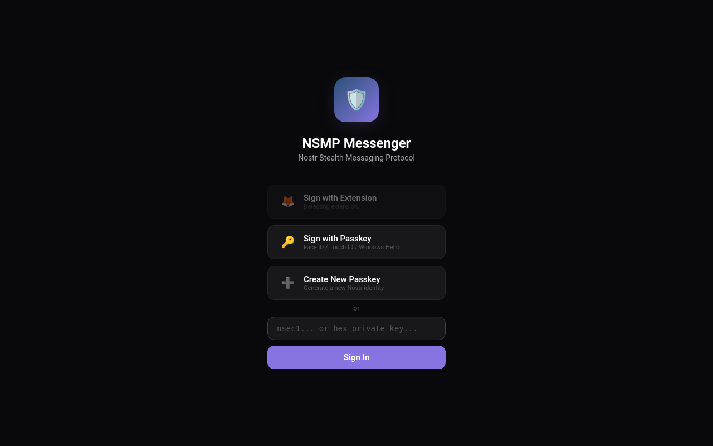
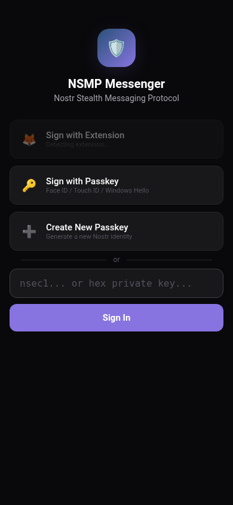

# NSMP — Nostr Stealth Messaging Protocol

**Metadata‑resistant, forward‑secret, relay‑hopping** messaging built on Nostr.

[](https://www.gnu.org/licenses/lgpl-3.0)

---

## What is NSMP?

NSMP is a privacy layer for Nostr messaging that hides **who** is talking to **whom**, **where** messages are stored, and **when** conversations happen — all while using standard Nostr primitives (NIP-44 encryption, events, and `p`-tags).

### Key properties

| Property | How |
|----------|-----|
| **Metadata privacy** | Messages are sharded across 6 relays. No single relay has the full message. Shard labels are random strings — no `msg_id`, no correlation. |
| **Forward secrecy** | Every round uses fresh ephemeral keypairs. All private keys are destroyed immediately after use. A compromised key cannot decrypt past messages. |
| **Relay rotation** | The relay set changes every round via `next_relays` embedded in the encrypted payload. Consecutive rounds use disjoint relay sets. |
| **Self‑healing** | Each shard contains the full encrypted payload plus `peer_relays` — the receiver finds the other shards even if some relays are down. |
| **No metadata leaks** | After the initial contact (where the recipient's main npub is visible in the `p`-tag), all visible keys are ephemeral. No conversation graph can be built. |

---

## Repository structure

```
nsmp/
├── src/              NSMP protocol library (TypeScript)
│   ├── client.ts     High-level client: listen, send, key lifecycle
│   ├── protocol.ts   Core protocol: sendMessage, processEvent, buildReply
│   ├── relay.ts      WebSocket relay: publish, subscribe, query
│   ├── shard.ts      Shard creation, labels, reassembly
│   ├── crypto.ts     NIP-44 encrypt/decrypt wrapper
│   ├── key.ts        Key generation, TempKeyStore
│   ├── pool.ts       Relay selection / rotation
│   └── index.ts      CLI (nsmp send | listen | generate-key)
├── ui/               PWA messaging app (Preact)
│   └── src/
│       ├── pages/    LoginPage, ChatPage
│       ├── components/ MessageBubble, ChatList, MessageInput, etc.
│       ├── stores/   Reactive state (auth, conversations, contacts)
│       ├── auth/     NIP-07 + passkey login adapters
│       └── nsmp/     Bridge between protocol library and UI
├── tests/            23 integration + unit tests
└── SPEC.md           Full protocol specification
```

---

## Quick start

### CLI

```bash
# Install dependencies
npm install

# Generate a keypair
node dist/index.js generate-key

# Listen for incoming NSMP messages
node dist/index.js listen -k <your-private-key>

# Send a message
node dist/index.js send -k <your-privkey> -r <recipient-pubkey> -m "Hello"
```

### PWA UI

```bash
cd ui
npm install
npm run dev     # Vite dev server with HMR
npm run build   # Production build with PWA service worker
```

### Screenshots

| Desktop | Mobile |
|---------|--------|
|  |  |

Open the dev URL (default `http://localhost:5173`). The PWA supports login via:

1. **NIP-07 extension** (nos2x, Alby, etc.)
2. **Passkey** (Face ID, Touch ID, Windows Hello) via `nostr-passkey`
3. **nsec** (private key hex or `nsec1…`)

---

## How it works

Every message send generates **6 ephemeral keypairs**: 3 sender keys (one per shard event) and 3 reply-target keys (for the next round).

1. **Sender** generates 3 sender keypairs + 3 reply-target keypairs. The message is encrypted (NIP-44) and split into 3 shards, each with a unique random label. Each shard is encrypted to the **recipient's current pubkey** using a **different sender key** and posted to a different pair of relays — 6 events total across 6 relays, each signed by a distinct key so relays cannot link them. The sender stores the 3 reply-target private keys.

2. **Receiver**, subscribed to their listening key, decrypts any shard they receive. The payload contains `shard_labels` (to identify the other shards) and `peer_relays` (to know which relays to query for them).

3. **Receiver** fetches the remaining shards and reassembles the message. The payload also contains `next_targets` (3 fresh temp npubs the sender is listening on) and `next_relays` (6 disjoint relays for the reply) — so the receiver can reply without ever knowing the sender's real npub.

4. **Temp npubs rotate every round**: when the sender receives a reply on one of their 3 temp npubs, the conversation advances to a new round with fresh keys and relays. All prior-round private keys are destroyed.

---

## Testing

```bash
npm test          # 23 tests
npm run typecheck # TypeScript strict
```

---

## License

LGPL-3.0-only. See [LICENSE](LICENSE) or <https://www.gnu.org/licenses/lgpl-3.0.html>.
